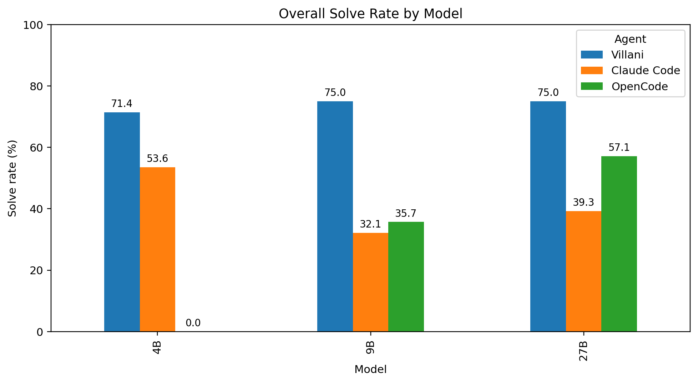
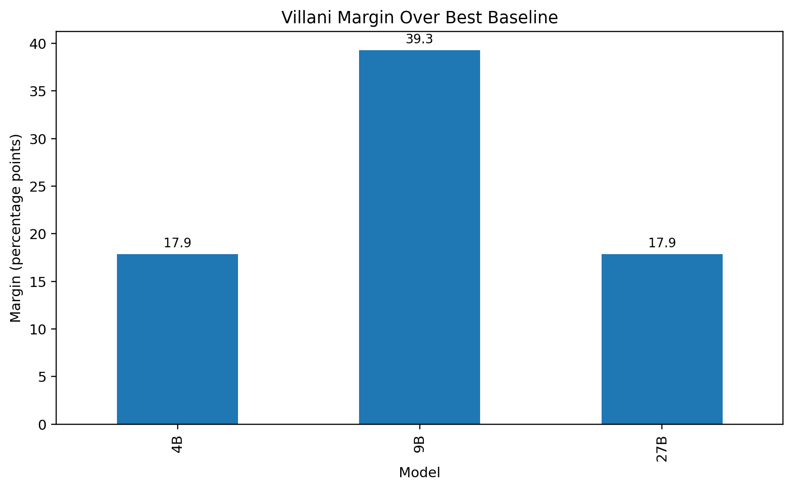
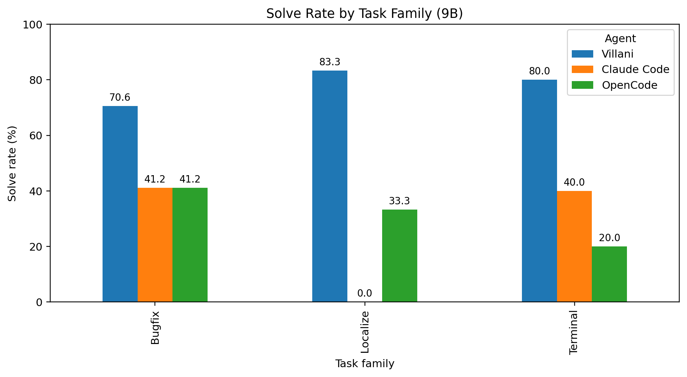

# Villani Code

**A coding agent runtime built to get useful repo work out of smaller local models.**

Most coding agents are tuned for the easiest version of the problem: strong hosted models, large context windows, and plenty of slack.

Villani Code is built for the harder version: constrained local models, bounded repository tasks, explicit control, and work that has to survive verification.

On the current benchmark runs in this repo, Villani Code achieved the highest solve rate at every reported Qwen 3.5 model size, with the clearest gain at **9B**.



## Why this exists

Small local models are cheap, private, and easy to deploy.

They are also easy to waste.

A weak model with a loose runtime drifts, edits the wrong files, burns context, and fails verification. A weak model with tighter execution can still land useful work.

That is the bet behind Villani Code.

## Benchmark snapshot

All headline numbers below are reported on the cleaned **28-task non-repro subset** of the current benchmark suite. OpenCode did not complete the 4B run, so that cell is omitted.

| Model | Villani | Claude Code | OpenCode |
|---|---:|---:|---:|
| Qwen 3.5 4B | **20/28 (71.4%)** | 15/28 (53.6%) | N/A |
| Qwen 3.5 9B | **21/28 (75.0%)** | 9/28 (32.1%) | 10/28 (35.7%) |
| Qwen 3.5 27B | **21/28 (75.0%)** | 11/28 (39.3%) | 16/28 (57.1%) |

The strongest result is at **9B**, where Villani Code more than doubled the solve rate of the two baseline agent runtimes on this task set.



## What the result means

The current evidence supports a specific claim:

**Runtime design matters a lot when the model is small.**

Villani Code appears to get materially better coding performance out of smaller local models than general-purpose coding-agent workflows on bounded repo tasks.

That is a much narrower claim than “this beats everything everywhere.” It is also the interesting one.

## Where the gains show up

The strongest pattern in the current benchmark is not just aggregate solve rate. It is task-family performance.

At **9B**, Villani Code led across all three task families, with the biggest edge in localization and bounded patch work.



### Qwen 3.5 9B by task family

| Family | Villani | Claude Code | OpenCode |
|---|---:|---:|---:|
| Bugfix | **12/17 (70.6%)** | 7/17 (41.2%) | 7/17 (41.2%) |
| Localize | **5/6 (83.3%)** | 0/6 (0.0%) | 2/6 (33.3%) |
| Terminal | **4/5 (80.0%)** | 2/5 (40.0%) | 1/5 (20.0%) |

This matters because localization is where weaker models usually fall apart. They read too much, touch the wrong files, or fail to land the fix cleanly.

## What Villani Code is

Villani Code is a terminal-first coding agent runtime designed for:

- bounded bug fixes
- repo navigation and file localization
- test-guided iteration
- constrained maintenance work
- privacy-sensitive codebases
- local inference setups where model budget matters

The goal is not to produce a clever transcript.

The goal is to land a patch that passes verification.

## What makes it different

### Built for constrained backends
Villani Code is designed around the failure modes of smaller models instead of pretending they do not matter.

### Terminal-first workflow
It operates where coding agents actually have to operate: files, commands, diffs, tests, and repo state.

### Tighter task discipline
The runtime is built to reduce drift, bound actions, and keep the model moving toward useful edits.

### Verification-oriented
The target is accepted work, not chat quality.

### Local-first by design
Villani Code fits environments where sending private code to hosted frontier APIs is not acceptable by default.

## Where it should win

Villani Code is a good fit when:

- private code must stay inside your environment
- model cost matters
- you want more useful work from 4B to 30B-class local models
- the task is bounded and verifier-friendly
- you care about limiting what the agent touches

## Where it is not trying to win

Villani Code is not trying to be:

- a general autonomous software engineer
- a frontier-model replacement
- a demo bot optimized for open-ended conversations
- a generic chat shell with code tools glued on

That is not the point.

The point is to make smaller local models much harder to dismiss.

## Installation

```bash
pip install .[tui]
```

Headless CLI only:

```bash
pip install .
```

Development dependencies:

```bash
pip install .[dev]
```

## Quickstart

Interactive session:

```bash
villani-code interactive --base-url http://127.0.0.1:1234 --model your-model --repo /path/to/repo
```

One-shot task:

```bash
villani-code run "Add retry handling to API client and update tests." --base-url http://127.0.0.1:1234 --model your-model --repo /path/to/repo
```

Bounded autonomous pass:

```bash
villani-code --villani-mode --base-url http://127.0.0.1:1234 --model your-model --repo /path/to/repo
```

## Benchmarking

Run the benchmark suite:

```bash
villani-code benchmark run \
  --suite benchmark_tasks/villani_bench_v1 \
  --agent villani \
  --provider openai \
  --model your-model \
  --base-url http://127.0.0.1:1234 \
  --api-key dummy \
  --output-dir artifacts/benchmark/run_name
```

Generate summaries:

```bash
villani-code benchmark summary --results artifacts/benchmark/run_name/results.jsonl
villani-code benchmark stats --results artifacts/benchmark/run_name/results.jsonl
```

## Reproducing the current figures

The plots used above were generated from the cleaned benchmark matrices derived from the current benchmark outputs.

Included report figures:

- `plot_01_overall_solve_rate.png`
- `plot_06_margin_over_best_baseline.png`
- `plot_family_9b.png`

## Current thesis

A better runtime can move the needle more than most people think.

Especially when the backend is small, local, private, and easy for everyone else to underestimate.

## Caveats

These results are promising, but they are not the final word.

The current README figures are based on the existing benchmark runs, after excluding `repro_*` tasks and normalizing to the shared non-repro subset. The next step is to tighten the benchmark further with repeated runs, a frozen held-out split, and ablations that isolate which parts of the runtime are driving the gains.
