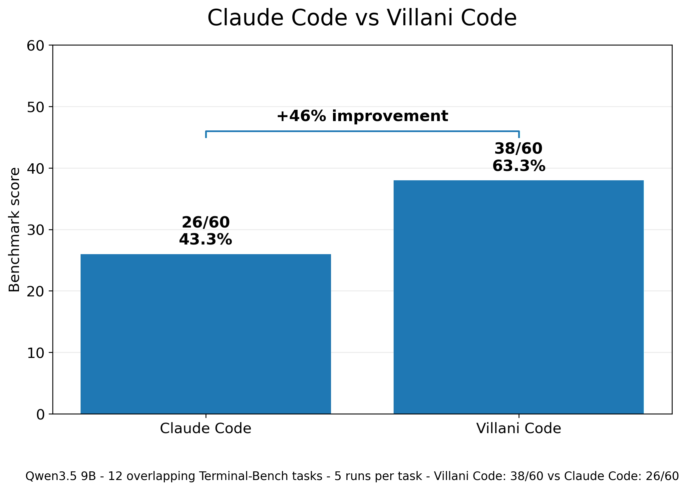

# Villani Code

**Flagship coding-agent performance from small local models.**

Villani Code is a local-first coding-agent runtime designed to make smaller open models do real repository work: navigate files, run commands, make patches, survive verification, and keep working through messy terminal environments.

The thesis is simple: small models do not just need better weights. They need a better runtime.

## Terminal-Bench 2.0: Qwen3.6 27B full-suite run

Villani Code achieved a **196/445 lower-bound score** on the full Terminal-Bench 2.0 suite using **Qwen3.6 27B**.

That is **44.0%** across **89 tasks** with **5 attempts per task**.


### Headline result

| System | Model | Terminal-Bench 2.0 accuracy |
|---|---|---:|
| Codex CLI | GPT-5-Codex | 44.3% |
| **Villani Code** | **Qwen3.6 27B** | **44.0%** |
| Mini-SWE-Agent | GPT-5-Codex | 41.3% |
| Claude Code | Claude Sonnet 4.5 | 40.1% |
| Dakou Agent | Qwen 3 Coder 480B | 27.2% |
| little-coder | Qwen3.6-35B-A3B | 24.6% |
| Bash Agent | TermiGen-32B | 19.3% |
| little-coder | Qwen3.5-9B | 9.2% |

**Villani Code lands within 0.3 percentage points of Codex CLI + GPT-5-Codex and ahead of Claude Code + Claude Sonnet 4.5, while running a much smaller local Qwen model.**

### Full report

The full visual report is available here:

[Villani Code Terminal-Bench 2.0 Qwen3.6 27B Report](docs/Villani_Code_Terminal_Bench_2_Qwen27B_Report.pdf)

Run status: self-run lower-bound benchmark result, not yet Terminal-Bench team verified.

## Why this matters

Most coding-agent performance is attributed to the foundation model.

Villani Code shows the runtime can move the frontier too.

The runner matters. Tool handling matters. Failure recovery matters. State management matters. The execution loop matters. The boring engineering around the model matters.

A smaller local model should not be dismissed as weak just because it is small. In the right runtime, it can perform in the same band as much larger flagship coding-agent stacks.

## Qwen3.5 9B same-model runtime comparison

Villani Code was also tested against Claude Code using the same model: **Qwen3.5 9B**.

Same model. Same tasks. Different agent runtime.

Villani Code won.



| Runner | Score | Success rate |
|---|---:|---:|
| **Villani Code + Qwen3.5 9B** | **38/60** | **63.3%** |
| Claude Code + Qwen3.5 9B | 26/60 | 43.3% |

**Villani Code delivered a 46% relative performance improvement over Claude Code.**

This comparison covers **12 overlapping Terminal-Bench tasks**, with **5 runs per task**, for **60 runs per agent**.

Villani Code won **6 tasks**, tied **6 tasks**, and lost **0**.

## What Villani Code is

Villani Code is a terminal-first coding agent for:

- bounded bug fixes
- repo navigation and localization
- command-driven debugging
- test-guided patching
- local inference setups
- privacy-sensitive codebases
- smaller open model backends

It is built for the environment where most coding agents start to fall apart: smaller models, hard verification, constrained context, terminal noise, failed commands, and real repositories.

## What changed in the upgraded runtime

The latest Villani Code upgrade includes:

- new execution loop
- better local model integration
- cleaner tool handling
- improved failure recovery
- task-scoped memory system
- better state tracking across long-running coding tasks

The benchmark comparison evaluates the upgraded runtime as a whole.

## Quickstart

Install with TUI support:

```bash
pip install .[tui]
```

Headless CLI only:

```bash
pip install .
```

Development dependencies:

```bash
pip install .[dev]
```

Interactive session:

```bash
villani-code interactive --base-url http://127.0.0.1:1234 --model your-model --repo /path/to/repo
```

One-shot task:

```bash
villani-code run "Add retry handling to API client and update tests." --base-url http://127.0.0.1:1234 --model your-model --repo /path/to/repo
```

Autonomous pass:

```bash
villani-code --villani-mode --base-url http://127.0.0.1:1234 --model your-model --repo /path/to/repo
```

## Use Villani Code in Pi

# @mmprotest/pi-villani
Install with:
```bash
pi install npm:@mmprotest/pi-villani
```
Provides `/villani <task>`.

Runtime version: `v0.1.5`.

## Pi Usage

Run Villani with `/villani <task>`. Active runs are still cleaned up automatically on process/session cancellation or error cleanup.

## Reports

- [Villani Code Terminal-Bench 2.0 Qwen3.6 27B Report](docs/Villani_Code_Terminal_Bench_2_Qwen27B_Report.pdf)
- [Villani Code Terminal_Bench 2.0 Qwen3.5 9B 12 Task Report](docs/Villani_Code_Terminal_Bench_2_12_Task_Report.pdf)
