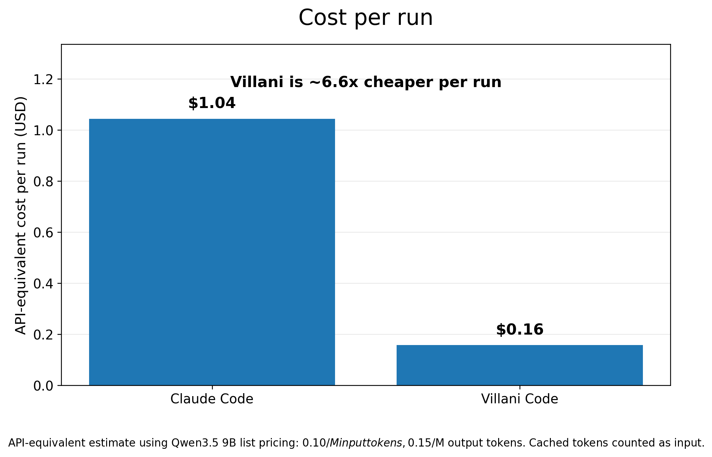
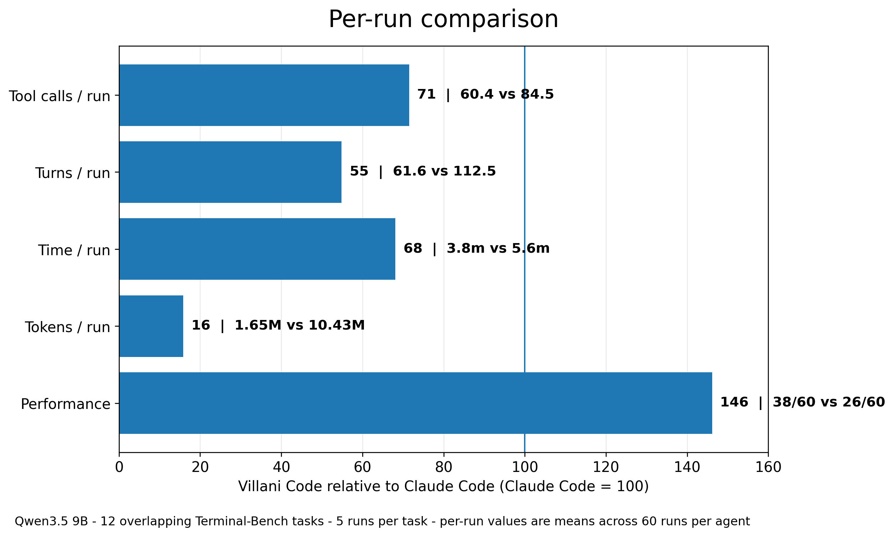
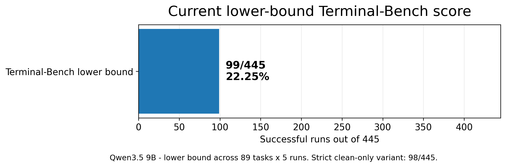

# Villani Code

**Plug in Villani Code, get a 46% performance improvement over Claude Code when using the same small model.**

Villani Code is a local-first coding-agent runtime designed to make smaller open models do real repository work: navigate files, run commands, make patches, survive verification, and keep working through messy terminal environments.

The latest upgraded Villani Code runtime was tested against Claude Code using the same model: **Qwen3.5 9B**.

Same model. Same tasks. Different agent runtime.

Villani Code won.


## Headline result

| Runner | Score | Success rate |
|---|---:|---:|
| **Villani Code + Qwen3.5 9B** | **38/60** | **63.3%** |
| Claude Code + Qwen3.5 9B | 26/60 | 43.3% |

**Villani Code delivered a 46% relative performance improvement over Claude Code.**

This comparison covers **12 overlapping Terminal-Bench tasks**, with **5 runs per task**, for **60 runs per agent**.

Villani Code won **6 tasks**, tied **6 tasks**, and lost **0**.

## Why this matters

Claude Code is backed by one of the strongest AI companies in the world. It usually gets to lean on frontier Claude models to do a lot of the heavy lifting.

This comparison removes that advantage.

Both systems ran on **Qwen3.5 9B**.

That makes the agent runtime visible.

The result: Villani Code performs better with the same small model.

The runner matters. Tool handling matters. Failure recovery matters. State management matters. The execution loop matters. The boring engineering around the model matters.

## Cost and efficiency

Villani Code did not get the higher score by spending more tokens.



| Metric | Villani Code | Claude Code |
|---|---:|---:|
| Score | **38/60** | 26/60 |
| Mean tokens / run | **1.65M** | 10.43M |
| Mean time / run | **3.8 min** | 5.6 min |
| Mean turns / run | **61.7** | 112.5 |
| Mean tool calls / run | **60.4** | 84.5 |
| Avg API-equivalent cost / run | **$0.16** | $1.04 |
| Cost / successful run | **$0.25** | $2.41 |

API-equivalent cost uses Qwen3.5 9B list pricing of **$0.10/M input tokens** and **$0.15/M output tokens**, with cached tokens counted as input tokens.



## Task-level comparison

| Task | Villani Code | Claude Code | Delta |
|---|---:|---:|---:|
| `build-pmars` | 4/5 | 1/5 | +3 |
| `fix-git` | 5/5 | 2/5 | +3 |
| `git-multibranch` | 3/5 | 1/5 | +2 |
| `kv-store-grpc` | 5/5 | 5/5 | +0 |
| `mcmc-sampling-stan` | 3/5 | 3/5 | +0 |
| `nginx-request-logging` | 5/5 | 4/5 | +1 |
| `openssl-selfsigned-cert` | 4/5 | 4/5 | +0 |
| `pypi-server` | 2/5 | 2/5 | +0 |
| `query-optimize` | 2/5 | 0/5 | +2 |
| `fix-code-vulnerability` | 1/5 | 1/5 | +0 |
| `largest-eigenval` | 2/5 | 1/5 | +1 |
| `sanitize-git-repo` | 2/5 | 2/5 | +0 |

| **Total** | **38/60** | **26/60** | **+12** |

## Current Terminal-Bench lower-bound score

Villani Code currently has a **99/445 lower-bound score** on the full Terminal-Bench 2.0 suite using Qwen3.5 9B.



| Score definition | Score | Rate |
|---|---:|---:|
| Verifier-counted lower bound | **99/445** | **22.25%** |
| Strict clean-only lower bound | 98/445 | 22.02% |

The official Terminal-Bench submission is being prepared.

## What Villani Code is

Villani Code is a terminal-first coding agent for:

- bounded bug fixes
- repo navigation and localization
- command-driven debugging
- test-guided patching
- local inference setups
- privacy-sensitive codebases
- smaller open model backends

It is built for the environment where most coding agents start to fall apart: smaller models, hard verification, constrained context, terminal noise, failed commands, and real repositories.

## What changed in the upgraded runtime

The latest Villani Code upgrade includes:

- new execution loop
- better local model integration
- cleaner tool handling
- improved failure recovery
- task-scoped memory system
- better state tracking across long-running coding tasks

The benchmark comparison evaluates the upgraded runtime as a whole.

## Thesis

**Small models do not just need better weights. They need a better runtime.**

Most coding-agent performance is attributed to the foundation model. This result shows the runtime can move the frontier too.

Same Qwen3.5 9B model.

Claude Code: 26/60.

Villani Code: 38/60.

That is the product thesis.

## Quickstart

Install with TUI support:

```bash
pip install .[tui]
```

Headless CLI only:

```bash
pip install .
```

Development dependencies:

```bash
pip install .[dev]
```

Interactive session:

```bash
villani-code interactive --base-url http://127.0.0.1:1234 --model your-model --repo /path/to/repo
```

One-shot task:

```bash
villani-code run "Add retry handling to API client and update tests." --base-url http://127.0.0.1:1234 --model your-model --repo /path/to/repo
```

Autonomous pass:

```bash
villani-code --villani-mode --base-url http://127.0.0.1:1234 --model your-model --repo /path/to/repo
```

## Report

The full benchmark report is available here:

```text
Villani_Code_Terminal_Bench_12_Task_Report.pdf
```
