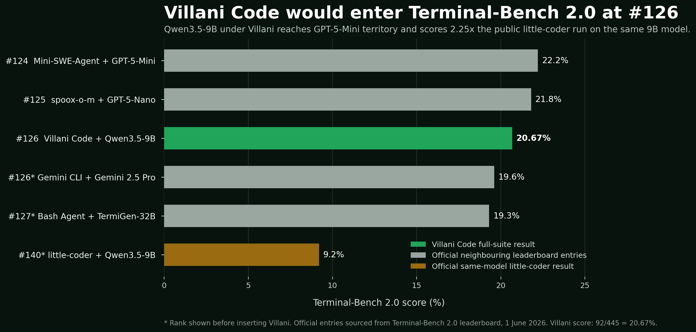

# Villani Code

**A local 9B coding agent just passed 92 verified Terminal-Bench attempts.**

Villani Code is the local-first terminal agent runtime pushing compact models into real software engineering work.

Running **Qwen3.5-9B** across the complete **Terminal-Bench 2.0** suite, Villani delivered:

| Metric | Result |
|---|---:|
| Tasks evaluated | 89 |
| Clean scored attempts | 445 |
| Verifier-accepted completions | **92** |
| Full-suite success rate | **20.67%** |
| Tasks successfully breached | **31** |
| Tasks conquered on every attempt | **8** |


## Villani enters the leaderboard at #126

At **20.67%**, Villani Code + Qwen3.5-9B slots into **#126** on the current Terminal-Bench 2.0 leaderboard, above **Gemini CLI + Gemini 2.5 Pro** and **Bash Agent + TermiGen-32B**.

The public **little-coder + Qwen3.5-9B** entry scores **9.2%**. Villani reaches **20.67%** using the same 9B model class: **2.25x the score**.



| Position | Agent | Model | Score |
|---:|---|---|---:|
| #124 | Mini-SWE-Agent | GPT-5-Mini | 22.2% |
| #125 | spoox-o-m | GPT-5-Nano | 21.8% |
| **#126** | **Villani Code** | **Qwen3.5-9B** | **20.67%** |
| #126 before insertion | Gemini CLI | Gemini 2.5 Pro | 19.6% |
| #127 before insertion | Bash Agent | TermiGen-32B | 19.3% |
| #140 before insertion | little-coder | Qwen3.5-9B | 9.2% |

*Official leaderboard entries sourced from Terminal-Bench 2.0 on 1 June 2026. Villani's position is calculated by inserting its 92/445 full-suite score into the published ranking.*

This is accepted work on hard terminal tasks from a local 9B model. Small local coding agents are already real. With the right runtime, they can navigate repositories, change code, operate terminal environments and land verified outcomes.

## Eight tasks conquered on every attempt

Villani solved each of these tasks **5/5**:

- `cobol-modernization`
- `fix-git`
- `git-leak-recovery`
- `merge-diff-arc-agi-task`
- `modernize-scientific-stack`
- `openssl-selfsigned-cert`
- `portfolio-optimization`
- `prove-plus-comm`

Ten more tasks were solved on a majority of attempts, extending the verified success frontier across repository repair, modernization, configuration, log handling and terminal-driven implementation work.

## What Villani Code is

Villani Code is a terminal-first runtime built to make compact local models finish real software engineering work.

Its standard is simple: **the task counts when the verifier accepts it.**

The runtime drives a model through the execution loop that real coding work demands:

1. inspect the repository and environment;
2. collect evidence using terminal commands;
3. make targeted code or configuration changes;
4. run verification;
5. recover from failure;
6. preserve traces for the next improvement cycle.

## Why this matters

A 9B local model does not have spare intelligence to waste on drift, redundant tool calls, weak recovery loops or performative transcripts.

That makes Villani's result decisive: compact models can already complete verified terminal work when the runtime keeps them focused on execution.

The full-suite evaluation delivered:

- **92** accepted completions;
- **31** tasks successfully breached;
- **18** tasks solved on a majority of attempts;
- **8** tasks solved every time.

The remaining unbeaten tasks define the next engineering campaign. Better recovery, tighter verification and stronger control over long-horizon execution will expand the frontier.

## Technical report

Read the complete report, including the full 89-task outcome map:

[`docs/Villani_Code_9B_Terminal_Bench_Technical_Report_Leaderboard.pdf`](docs/Villani_Code_9B_Terminal_Bench_Technical_Report_Leaderboard.pdf)

## Benchmark protocol

| Item | Value |
|---|---|
| Benchmark | Terminal-Bench 2.0 |
| Backend model | Qwen3.5-9B |
| Agent runtime | Villani Code |
| Tasks | 89 |
| Attempts per task | 5 |
| Acceptance criterion | Benchmark verifier pass |
| Clean result | **92/445 accepted completions (20.67%)** |

A duplicated extra five-attempt `qemu-startup` record was removed from the archive to preserve the fixed five-attempt protocol.

## Installation

Install with TUI support:

```bash
pip install .[tui]
```

Headless CLI only:

```bash
pip install .
```

Development dependencies:

```bash
pip install .[dev]
```

## Usage

Interactive session:

```bash
villani-code interactive --base-url http://127.0.0.1:1234 --model your-model --repo /path/to/repo
```

One-shot task:

```bash
villani-code run "Add retry handling to API client and update tests." --base-url http://127.0.0.1:1234 --model your-model --repo /path/to/repo
```

Autonomous pass:

```bash
villani-code --villani-mode --base-url http://127.0.0.1:1234 --model your-model --repo /path/to/repo
```

## The mission

**Make compact local coding agents finish real work.**

Villani Code is building the runtime that gets them there.