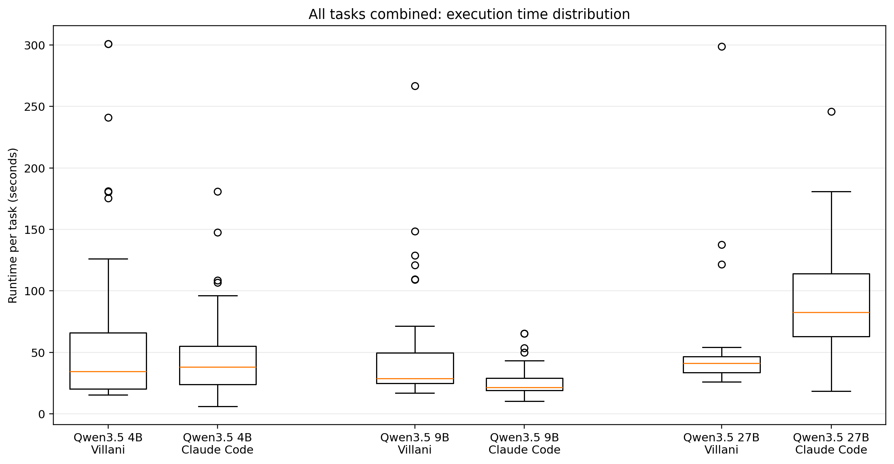

# Villani Code Technical Report

## Executive Summary

Villani Code is a terminal-first coding agent runtime designed to extract materially better repository work from smaller local models.

The core idea is simple: weak models fail when the runtime is loose. They drift, read too much, touch the wrong files, and collapse under ambiguous search and verification loops. Villani Code attacks that failure mode directly. It constrains the interaction surface, keeps the agent close to the repository, drives work through explicit tooling, and orients execution around passing verification rather than producing an impressive transcript.

On the benchmark runs included in this repo, Villani Code outperformed Claude Code on the same Qwen3.5 backends at every tested model size: 4B, 9B, and 27B. At 27B, the result is especially strong because Villani is both more effective and more efficient overall.

This report covers two things:
1. how the Villani runner works
2. what the current benchmark results show

---

## 1. What Villani Code Is

Villani Code is not a generic chat wrapper with code tools attached.

It is a coding-agent runtime built for bounded repository work under real constraints:
- local or self-hosted model backends
- limited context budgets
- explicit filesystem and shell actions
- repository tasks that can be verified with tests, commands, diffs, and acceptance checks

The target is useful repo work. Not vibes. Not a clever transcript. Not a demo that looks smart while failing verification.

The runtime is aimed at the class of tasks where a model can be useful if the execution loop is disciplined:
- bounded bug fixes
- file localization and targeted patching
- repo navigation under ambiguity
- constrained maintenance tasks
- verifier-friendly tasks where success is externally testable

---

## 2. Design Thesis

The Villani thesis is that runtime design can shift the capability frontier of small models.

Most coding-agent workflows quietly assume strong hosted models, excess context, and enough raw model ability to recover from sloppy execution. That assumption breaks down fast on smaller local models.

Small models do not need more freedom. They need more structure.

Villani Code is built around that premise:
- reduce drift
- keep actions grounded in repository state
- force the model to work through tools instead of hand-waving
- prefer narrow, verifiable progress over broad speculative exploration
- optimize for accepted patches, not entertaining chatter

The consequence is important: the runner becomes part of the capability story. The model matters, but the loop around the model matters too.

---

## 3. How the Villani Runner Works

At a high level, the Villani runner is a repository execution loop that turns the model into a guided operator inside a constrained environment.

### 3.1 Core operating model

The runner takes:
- a task or benchmark objective
- a repository root
- a defined tool surface
- a model backend
- a set of verification signals

It then executes a bounded loop:

1. inspect the repo state
2. localize the relevant files and failure points
3. propose a small next action
4. execute through tools
5. observe the result
6. refine
7. stop when the patch is landed or the task boundary is reached

This sounds obvious, but this is where most small-model failures happen. Weak models are extremely sensitive to the quality of that loop.

### 3.2 Terminal-first tool loop

Villani is built around the environment where repository work actually happens:
- files
- diffs
- shell commands
- test runs
- repository state
- bounded write operations

The runner works through explicit tools rather than relying on free-form reasoning alone. That matters because a tool-mediated loop creates hard feedback. The model cannot simply assert that it fixed the problem. It has to read, act, and survive verification.

### 3.3 Localization before patching

A critical part of the Villani approach is front-loading localization pressure.

Many coding agents waste performance by letting the model roam too widely. Small models are especially bad at this. They over-read, lose the thread, edit adjacent code, or patch the wrong abstraction.

Villani counters that by pushing the loop toward:
- targeted search
- repo navigation
- explicit file selection
- narrow edit scopes
- patch attempts tied to observed evidence

This is why the runtime should be especially strong on localization-heavy tasks.

### 3.4 Small-step action discipline

The runner is designed to favor small, recoverable actions over broad speculative rewrites.

Instead of encouraging expansive behavior, it biases toward:
- incremental repo reads
- narrow patches
- rapid verifier feedback
- revision after concrete failure signals

That discipline is not cosmetic. It is one of the main reasons a smaller backend can keep producing useful work instead of spiraling.

### 3.5 Verification-oriented execution

Villani is built around an external notion of success.

The patch is not successful because the model says it is successful. It is successful because the task verifier, test command, or contract says so.

In practice that means the loop is centered on:
- command execution
- tests
- visible verifier outputs
- repository diffs
- completion conditions defined by the task

This is the correct way to run smaller coding models. You do not ask them to be trusted. You make them earn progress under feedback.

### 3.6 Bounded autonomy

Villani supports interactive use, one-shot task execution, and bounded autonomous passes. In each case, the central idea is the same: autonomy is applied inside a constrained repo workflow, not as open-ended software-engineer cosplay.

That distinction matters. The runner is not trying to win by pretending the model is a general autonomous employee. It is trying to win by making bounded code work land reliably.

---

## 4. Why This Runner Should Beat Looser Agent Workflows

A small model plus a sloppy runtime is a bad system.

Common failure modes in weaker coding agents include:
- reading too much irrelevant code
- patching the wrong files
- losing task boundaries
- spending tokens on narrative instead of work
- failing to use verifier feedback effectively
- turning simple bugfixes into unstable rewrites

Villani is built to suppress exactly those behaviors.

That gives it a structural advantage on bounded tasks where the path to success is:
- find the right place
- make the right change
- prove that it worked

That is not the full universe of software engineering. It is, however, a very large and commercially relevant slice of repo automation.

---

## 5. Benchmark Setup

The benchmark results in this report come from the benchmark runs bundled with the current project outputs.

### 5.1 Compared runners

The comparison here focuses on:
- Villani Code
- Claude Code

### 5.2 Shared backends

Both runners were tested on the same model family and sizes:
- Qwen3.5 4B
- Qwen3.5 9B
- Qwen3.5 27B

### 5.3 Task pool

The plotted comparisons combine the benchmark tasks used across the available base and gapfill runs, and the task-type breakdown focuses on the three meaningful task families visible in the benchmark IDs:
- Bugfix
- Localize
- Terminal

### 5.4 Evaluation focus

The report emphasizes four outcome views:
- total solve performance
- total runtime
- execution time distribution
- solved-task counts by task type

---

## 6. Benchmark Results

## 6.1 Overall success rate

Villani Code led at every tested model size.

Combined across the plotted task runs:
- **Qwen3.5 4B:** Villani solved 33/40 vs Claude Code 28/40
- **Qwen3.5 9B:** Villani solved 34/40 vs Claude Code 30/40
- **Qwen3.5 27B:** Villani solved 37/40 vs Claude Code 28/40

That pattern matters for one reason: it is consistent. This is not a single lucky model-size spike. Villani is ahead across the entire tested Qwen3.5 range.

## 6.2 Success versus total runtime

The cleanest chart in the set is the frontier chart.

This chart shows the real story:
- at **4B** and **9B**, Villani is more effective overall, though often slower
- at **27B**, Villani is both **better** and **faster**

That 27B result is the strongest benchmark claim in the current set. It means the Villani runtime is not merely trading speed for quality. On the strongest backend tested, it shifts the frontier outright.

## 6.3 Execution time distribution

Execution time is not uniform across the sizes.

The distribution view is useful because it prevents a lazy reading of the benchmark story. Villani is not simply “the faster runner” in every condition. That would be a weaker and less interesting claim anyway.

The stronger claim is this:
- Villani converts runtime into solved work more effectively
- and at 27B, it wins both axes simultaneously

That is a much more serious result.

## 6.4 Task-type breakdown

The task-family chart shows where the runner advantage is concentrated.

Key reads:
- **27B:** Villani wins Bugfix, Localize, and Terminal
- **9B:** Villani is strongest on Terminal and ahead on Localize, while Bugfix is tied
- **4B:** Villani leads overall and is notably stronger on Localize

The most important family here is **Localize**.

Localization is where weak coding systems usually embarrass themselves. They search too broadly, edit the wrong place, and lose the thread before the patch even begins. Villani's task-family edge strongly suggests that its tighter repo-navigation and patch-discipline loop is doing real work.

---

## 7. Why the Results Matter

These benchmark results support a sharp claim:

**A better runner can extract materially better coding performance from the same small local backend.**

That is commercially important.

If this holds in broader use, it means the market does not belong only to the companies with the biggest hosted models. There is real room for a runtime layer that makes smaller local models substantially more useful in production code workflows.

That matters because smaller local models are:
- cheaper to run
- easier to deploy
- more private
- more controllable
- far more realistic for many organizations than constant dependence on remote frontier APIs

Villani Code is not selling a fantasy. It is selling a stronger control loop around the model you already have.

---

## 8. Practical Positioning

Villani Code should be understood as infrastructure for constrained coding performance.

The strongest fit is:
- organizations that want private code to stay local
- teams that care about model cost
- workflows dominated by bounded repo tasks
- environments where explicit control and verification matter more than flashy agent behavior

This is not a toy niche. It is a large category of real engineering work.

A runner that makes 4B to 30B-class local backends materially more useful is not just technically interesting. It is strategically valuable.

---

## 9. Conclusion

Villani Code is a runtime built around a hard truth: small models fail when the loop around them is weak.

The answer is not to pretend they are frontier models.
The answer is to run them properly.

That is what Villani Code does.

It constrains the execution loop, keeps the agent close to the repository, emphasizes localization, favors small corrective actions, and drives progress through verification. The benchmark results show that this is not abstract theory. It produces stronger repo-task performance than a looser baseline on the same Qwen3.5 backends, and at 27B it wins on both solve rate and total runtime.

The implication is straightforward.

**Villani Code does not just use local models. It makes them hit harder.**
