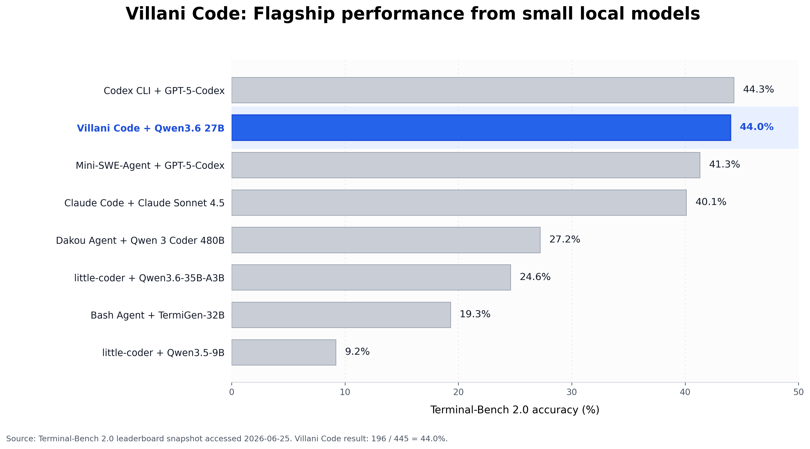

# Villani Code Terminal-Bench 2.0 Report

**Villani Code: Flagship performance from small local models**

## Executive summary

Villani Code achieved **196 successful attempts out of 445** on the full Terminal-Bench 2.0 run using **Qwen3.6 27B**, for a final score of **44.0%**.

This is the story: **flagship performance from a small local model**. Villani Code lands essentially level with **Codex CLI + GPT-5-Codex at 44.3%**, ahead of **Mini-SWE-Agent + GPT-5-Codex at 41.3%**, ahead of **Claude Code + Claude Sonnet 4.5 at 40.1%**, and substantially ahead of the visible public Qwen-family entries.

This does not claim Villani Code is the top system on Terminal-Bench 2.0. It is not. The strongest systems are higher. The point is more specific and more commercially useful: Villani Code shows that a local-first runtime can extract flagship-agent performance from a much smaller Qwen model.

## Run result

| Metric | Result |
|---|---:|
| Benchmark | Terminal-Bench 2.0 |
| Model | Qwen3.6 27B |
| Agent | Villani Code |
| Tasks | 89 |
| Attempts per task | 5 |
| Total scored attempts | 445 |
| Successful attempts | **196** |
| Final score | **44.0%** |
| Tasks with at least one pass | **51/89** |
| Task solve coverage | **57.3%** |
| Tasks solved 5/5 | **20** |

## Why this matters

Most coding-agent performance is attributed to the foundation model. This run makes the runtime visible.

Villani Code with Qwen3.6 27B reaches the same Terminal-Bench 2.0 performance band as Codex CLI with GPT-5-Codex and beats Claude Code with Sonnet 4.5. That is not because Qwen3.6 27B is the biggest or most expensive model in the comparison. It is because Villani Code turns model capability into terminal work: navigating repositories, running commands, recovering from failures, editing files, and surviving verification.

The runner matters. The execution loop matters. Verification discipline matters. Local models need more than weights. They need a serious runtime.

## Leaderboard context

The chart compares Villani Code to selected Terminal-Bench 2.0 entries that make the story readable: Codex CLI + GPT-5-Codex, Mini-SWE-Agent + GPT-5-Codex, Claude Code + Claude Sonnet 4.5, and public Qwen-family entries. GPT-5.5, GPT-5.3-Codex, and Claude Opus 4.6 entries are intentionally left out of the chart so the comparison focuses on the performance band around Villani Code and the Qwen baseline family.

The clean comparison is:

| Entry | Score | Delta vs Villani |
|---|---:|---:|
| Codex CLI + GPT-5-Codex | 44.3% | -0.3 pp |
| **Villani Code + Qwen3.6 27B** | **44.0%** | **0.0 pp** |
| Mini-SWE-Agent + GPT-5-Codex | 41.3% | +2.7 pp |
| Claude Code + Claude Sonnet 4.5 | 40.1% | +3.9 pp |
| Dakou Agent + Qwen 3 Coder 480B | 27.2% | +16.8 pp |
| little-coder + Qwen3.6-35B-A3B | 24.6% | +19.4 pp |
| Bash Agent + TermiGen-32B | 19.3% | +24.7 pp |
| little-coder + Qwen3.5-9B | 9.2% | +34.8 pp |

## Capability profile

The run was not carried by isolated lucky solves. The raw task distribution shows a large stable band:

| Raw task score | Number of tasks |
|---:|---:|
| 5/5 | 20 |
| 4/5 | 12 |
| 3/5 | 13 |
| 2/5 | 3 |
| 1/5 | 3 |
| 0/5 | 38 |

Villani Code solved **45 tasks at least 3/5**, **32 tasks at least 4/5**, and **20 tasks on every attempt**.

The main weakness is not that the system is unreliable everywhere. The weakness is coverage. There are 38 tasks where the current system scored 0/5. That creates a clear engineering path: keep the stable wins, analyze the unstable middle band, then classify and attack the zero-pass frontier.

## Product implication

This run supports the core Villani Code thesis:

> Small local models do not just need better weights. They need a better runtime.

Villani Code is built for the environment where coding agents usually start to fall apart: smaller models, real terminals, noisy command output, failed commands, constrained context, repository state, verification pressure, and long task horizons.

This Terminal-Bench 2.0 run shows that the architecture works. A compact local model can be pushed into the same public performance band as major hosted-agent baselines when the runtime is strong enough.

## Raw task scores

All 89 Terminal-Bench 2.0 tasks are accounted for below. Each score is the number of successful runs out of 5.

| Task | Raw score |
|---|---:|
| `terminal-bench/adaptive-rejection-sampler` | 0/5 |
| `terminal-bench/bn-fit-modify` | 5/5 |
| `terminal-bench/break-filter-js-from-html` | 3/5 |
| `terminal-bench/build-cython-ext` | 4/5 |
| `terminal-bench/build-pmars` | 4/5 |
| `terminal-bench/build-pov-ray` | 0/5 |
| `terminal-bench/caffe-cifar-10` | 0/5 |
| `terminal-bench/cancel-async-tasks` | 2/5 |
| `terminal-bench/chess-best-move` | 0/5 |
| `terminal-bench/circuit-fibsqrt` | 0/5 |
| `terminal-bench/cobol-modernization` | 5/5 |
| `terminal-bench/code-from-image` | 4/5 |
| `terminal-bench/compile-compcert` | 3/5 |
| `terminal-bench/configure-git-webserver` | 5/5 |
| `terminal-bench/constraints-scheduling` | 4/5 |
| `terminal-bench/count-dataset-tokens` | 4/5 |
| `terminal-bench/crack-7z-hash` | 5/5 |
| `terminal-bench/custom-memory-heap-crash` | 4/5 |
| `terminal-bench/db-wal-recovery` | 0/5 |
| `terminal-bench/distribution-search` | 5/5 |
| `terminal-bench/dna-assembly` | 0/5 |
| `terminal-bench/dna-insert` | 0/5 |
| `terminal-bench/extract-elf` | 4/5 |
| `terminal-bench/extract-moves-from-video` | 0/5 |
| `terminal-bench/feal-differential-cryptanalysis` | 0/5 |
| `terminal-bench/feal-linear-cryptanalysis` | 0/5 |
| `terminal-bench/filter-js-from-html` | 0/5 |
| `terminal-bench/financial-document-processor` | 4/5 |
| `terminal-bench/fix-code-vulnerability` | 5/5 |
| `terminal-bench/fix-git` | 5/5 |
| `terminal-bench/fix-ocaml-gc` | 3/5 |
| `terminal-bench/gcode-to-text` | 0/5 |
| `terminal-bench/git-leak-recovery` | 5/5 |
| `terminal-bench/git-multibranch` | 5/5 |
| `terminal-bench/gpt2-codegolf` | 0/5 |
| `terminal-bench/headless-terminal` | 5/5 |
| `terminal-bench/hf-model-inference` | 5/5 |
| `terminal-bench/install-windows-3-11` | 0/5 |
| `terminal-bench/kv-store-grpc` | 5/5 |
| `terminal-bench/large-scale-text-editing` | 3/5 |
| `terminal-bench/largest-eigenval` | 2/5 |
| `terminal-bench/llm-inference-batching-scheduler` | 1/5 |
| `terminal-bench/log-summary-date-ranges` | 5/5 |
| `terminal-bench/mailman` | 3/5 |
| `terminal-bench/make-doom-for-mips` | 0/5 |
| `terminal-bench/make-mips-interpreter` | 0/5 |
| `terminal-bench/mcmc-sampling-stan` | 4/5 |
| `terminal-bench/merge-diff-arc-agi-task` | 5/5 |
| `terminal-bench/model-extraction-relu-logits` | 0/5 |
| `terminal-bench/modernize-scientific-stack` | 5/5 |
| `terminal-bench/mteb-leaderboard` | 0/5 |
| `terminal-bench/mteb-retrieve` | 0/5 |
| `terminal-bench/multi-source-data-merger` | 5/5 |
| `terminal-bench/nginx-request-logging` | 4/5 |
| `terminal-bench/openssl-selfsigned-cert` | 4/5 |
| `terminal-bench/overfull-hbox` | 2/5 |
| `terminal-bench/password-recovery` | 1/5 |
| `terminal-bench/path-tracing` | 0/5 |
| `terminal-bench/path-tracing-reverse` | 0/5 |
| `terminal-bench/polyglot-c-py` | 0/5 |
| `terminal-bench/polyglot-rust-c` | 0/5 |
| `terminal-bench/portfolio-optimization` | 5/5 |
| `terminal-bench/protein-assembly` | 0/5 |
| `terminal-bench/prove-plus-comm` | 5/5 |
| `terminal-bench/pypi-server` | 3/5 |
| `terminal-bench/pytorch-model-cli` | 4/5 |
| `terminal-bench/pytorch-model-recovery` | 0/5 |
| `terminal-bench/qemu-alpine-ssh` | 0/5 |
| `terminal-bench/qemu-startup` | 0/5 |
| `terminal-bench/query-optimize` | 1/5 |
| `terminal-bench/raman-fitting` | 0/5 |
| `terminal-bench/regex-chess` | 0/5 |
| `terminal-bench/regex-log` | 5/5 |
| `terminal-bench/reshard-c4-data` | 3/5 |
| `terminal-bench/rstan-to-pystan` | 3/5 |
| `terminal-bench/sam-cell-seg` | 0/5 |
| `terminal-bench/sanitize-git-repo` | 3/5 |
| `terminal-bench/schemelike-metacircular-eval` | 0/5 |
| `terminal-bench/sparql-university` | 3/5 |
| `terminal-bench/sqlite-db-truncate` | 3/5 |
| `terminal-bench/sqlite-with-gcov` | 3/5 |
| `terminal-bench/torch-pipeline-parallelism` | 0/5 |
| `terminal-bench/torch-tensor-parallelism` | 0/5 |
| `terminal-bench/train-fasttext` | 0/5 |
| `terminal-bench/tune-mjcf` | 3/5 |
| `terminal-bench/video-processing` | 0/5 |
| `terminal-bench/vulnerable-secret` | 5/5 |
| `terminal-bench/winning-avg-corewars` | 0/5 |
| `terminal-bench/write-compressor` | 0/5 |
